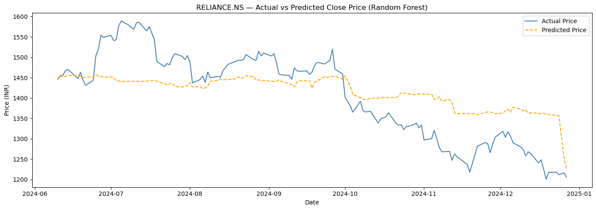

# 📈 Stock Price Trend Predictor

## 🚀 Overview
This project predicts stock price trends using Machine Learning.

## 🧠 Features
- Moving Averages (MA20, MA50)
- RSI (Relative Strength Index)
- Lag features
- Random Forest model

## 🛠 Tech Stack
- Python
- Pandas, NumPy
- scikit-learn
- Matplotlib
- yfinance

## 📊 Output
- Actual vs Predicted stock prices
- Model evaluation (MAE, R², Directional Accuracy)

## 📷 Sample Output

